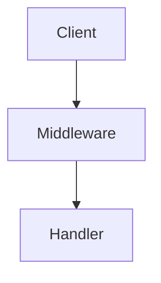

# Documentation Manager

This skill creates and maintains comprehensive, standardized project documentation using a **coordinator + parallel workers** architecture. A coordinator agent first analyzes the codebase, then spawns specialized agents in parallel for each documentation type.

## Modes

- **`init`** - Create initial documentation structure for a new or existing project, then review
- **`update`** - Update all documentation to reflect current codebase state, then review
- **`update <doc>`** - Update a specific documentation file (e.g., `update api`), then review it
- **`review`** - Review docs for consistency, completeness, and accuracy (standalone mode)
- **`sync`** - Full sync: analyze codebase and update all docs, then review
- **`resolve`** - Scan existing docs for placeholders and help resolve them (standalone mode)
- **`upgrade-diagrams`** - Scan all docs and convert ASCII/text diagrams to mermaid format (standalone mode)
- **`help`** - Display help information about available commands and usage

## Standard Documentation Structure

```
docs/
├── README.md                  # Documentation index and navigation (at root)
└── project/                   # All project documentation
    ├── PROJECT_OVERVIEW.md    # Project purpose, domain, business context
    ├── ARCHITECTURE.md        # System architecture and design decisions
    ├── DATABASE.md            # Database schema, models, relationships
    ├── API.md                 # API endpoints, request/response formats
    ├── ENVIRONMENT.md         # Environment variables, config, secrets
    ├── DEPLOYMENT.md          # Deployment processes and environments
    ├── DEVELOPER.md           # Development setup, standards, conventions
    ├── TESTING.md             # Testing strategy, coverage, patterns
    ├── STYLE_GUIDE.md         # Coding style and formatting rules
    ├── INFRASTRUCTURE.md      # Infrastructure, DNS, hosting details
    ├── SECURITY.md            # Security considerations and practices
    ├── TROUBLESHOOTING.md     # Common issues, debugging guides, FAQs
    └── CHANGELOG.md           # Version history and changes
```

Not all docs are needed for every project. The skill detects project type and creates only relevant documentation.

**Note:** The README.md stays at `docs/` root level as the index, while all other documentation files go in `docs/project/`. This keeps the docs folder clean and allows for other types of documentation (like API specs, design docs, etc.) to have their own subdirectories later.

## Architecture: Coordinator + Parallel Workers

### Phase 1: Coordinator Agent (Analysis)

Launch ONE coordinator agent that:

1. **Project Detection** - Identify runtime, framework, database, infrastructure
2. **Business Context Collection** - Ask user key questions about project purpose:
   ```
   - What is this project? (e.g., restaurant website, e-commerce, SaaS dashboard)
   - Who are the target users?
   - Any specific business rules or domain knowledge to document?
   ```
3. **Existing Docs Scan** - Check what documentation already exists
4. **Plan Generation** - Determine which docs to create/update

### Phase 2: Parallel Worker Agents

The coordinator spawns worker agents IN PARALLEL for each doc type:

```
Worker 1: PROJECT_OVERVIEW.md
Worker 2: ARCHITECTURE.md
Worker 3: DATABASE.md (if database present)
Worker 4: API.md (if API present)
Worker 5: ENVIRONMENT.md
Worker 6: DEPLOYMENT.md
Worker 7: DEVELOPER.md
Worker 8: TESTING.md
Worker 9: STYLE_GUIDE.md
Worker 10: INFRASTRUCTURE.md
Worker 11: SECURITY.md
Worker 12: TROUBLESHOOTING.md
```

Each worker receives:
- Project analysis from coordinator
- Business context from user prompts
- Relevant code paths to analyze
- Template from `references/templates.md`

### Phase 3: Index & Summary

Create `docs/README.md` index with:
- Navigation to all docs in `project/` subdirectory
- Brief descriptions
- Reading order for onboarding

### Phase 4: Placeholder Resolution

After docs are created/updated, automatically attempt to resolve placeholders. This phase runs for:
- `init` - after creating initial docs
- `update` - after updating docs
- `sync` - after full sync
- `resolve` - standalone mode to only resolve placeholders

### Phase 5: Review

After placeholders are resolved, automatically run a documentation review. This phase runs for:
- `init` - after placeholder resolution
- `update` - after placeholder resolution
- `sync` - after placeholder resolution
- `review` - standalone mode to only review docs

**Review checks:**

1. **Consistency** - Verify terminology, naming conventions, and formatting are consistent across all docs
2. **Completeness** - Check all expected sections exist and have meaningful content (not just placeholders)
3. **Accuracy** - Cross-reference documented endpoints, schemas, configs with actual codebase
4. **Links** - Verify internal links between docs work and external links are valid
5. **Currency** - Flag any outdated information that doesn't match current code state

**Review output:** Summary report with:
- ✅ Checks passed
- ⚠️ Warnings (minor issues that don't block)
- ❌ Issues requiring attention (broken links, outdated info, missing sections)

**Process:**

1. **Scan for Placeholders** - Search all docs for `[TODO:` patterns
2. **Group by Topic** - Cluster placeholders that can be answered together:
   | Group | Typical Placeholders | Example Question |
   |-------|---------------------|------------------|
   | Business Context | Project purpose, target users, domain knowledge | "What is this project and who is it for?" |
   | Infrastructure | Hosting provider, server names, DNS details | "Where is this project hosted and what are the server details?" |
   | Deployment | Environments, CI/CD, deployment steps | "What are your deployment environments and process?" |
   | Team/Contacts | Stakeholders, IT contacts, support channels | "Who are the key stakeholders and contacts?" |
   | External Services | Third-party APIs, integrations, documentation links | "What external services does this project integrate with?" |
3. **Batch Questions** - Ask the user one question per group, not one per placeholder
4. **Apply Answers** - Update all relevant docs with the resolved values
5. **Iterate** - If new placeholders emerge or some remain, continue until resolved or user confirms they'll handle manually

**Standalone `resolve` mode:**

When you run `/freya-devkit:docs-manager resolve`, the skill:
1. Scans all existing docs in the `docs/project/` directory
2. Finds all `[TODO:` placeholders
3. Groups them and asks you batched questions
4. Updates the docs with your answers

This is useful when you've already run `sync` or `init` and want to come back later to fill in placeholders.

**Example Grouping:**

If you find:
- INFRASTRUCTURE.md: `[TODO: hosting provider]`
- DEPLOYMENT.md: `[TODO: deployment server URL]`
- API.md: `[TODO: production API base URL]`

Ask ONE question: "Where is this project hosted (e.g., Hetzner, Vercel, AWS)? Please include the server/domain details." Then update all three docs with the answer.

### Phase 6: Diagram Upgrade (standalone `upgrade-diagrams` mode)

When you run `/freya-devkit:docs-manager upgrade-diagrams`, the skill:

1. **Scan for Diagrams** - Search all docs in `docs/project/` for:
   - ASCII art diagrams (boxes with `+--+`, `|`, `-`)
   - Text-based flow diagrams (arrows like `-->`, `->`)
   - Indented hierarchy diagrams
   - Any visual representations not already in mermaid format

2. **Identify Diagram Type** - Classify each found diagram:

   | Type | Indicators | Mermaid Equivalent |
   |------|------------|-------------------|
   | Flow/Process | Steps with arrows, decision points | `flowchart TD` or `flowchart LR` |
   | Architecture | Boxes as components/services | `graph TD` |
   | Sequence | Steps with actors over time | `sequenceDiagram` |
   | ER/Database | Entities with relationships | `erDiagram` |
   | State | States and transitions | `stateDiagram-v2` |

3. **Convert to Mermaid** - Transform each diagram:
   - Parse the ASCII/text structure
   - Generate equivalent mermaid syntax
   - Preserve all labels, connections, and annotations

4. **Update Docs** - Replace old diagrams with mermaid versions

5. **Report Changes** - Summarize what was converted

**Example Conversion:**

Before (ASCII):
```
+----------------+     +----------------+
|    Client      | --> |   Middleware    |
+----------------+     +----------------+
                              |
                              v
                       +----------------+
                       |    Handler      |
                       +----------------+
```

After (Mermaid):


**When to use:**
- After upgrading from an older version of this skill
- When you've manually added ASCII diagrams
- To make docs render better in GitHub, GitLab, and other markdown viewers that support mermaid

## Worker Agent Instructions

Each worker agent receives project context and focuses only on its assigned documentation:

### PROJECT_OVERVIEW Worker
**Context to gather:**
- Business domain from user prompt
- Target audience/use case
- Key features and value proposition
- Project timeline/status

**Output:** Clear project description for anyone (including AI) to understand the domain

### ARCHITECTURE Worker
**Context to gather:**
- Main entry points
- Core modules and their responsibilities
- Data flow patterns
- Key design decisions
- External dependencies and integrations

**Output:** System architecture with diagrams (mermaid or ASCII)

### DATABASE Worker
**Context to gather:**
- ORM models or schema definitions
- Migration files
- Relationships between entities
- Indexes and constraints

**Output:** Entity-relationship documentation with schema details

### API Worker
**Context to gather:**
- Route definitions
- Controller/handler files
- Authentication approach
- Request/response schemas

**Output:** Endpoint documentation with examples

### ENVIRONMENT Worker
**Context to gather:**
- .env.example files
- Environment variable usage in code
- Configuration files
- Secrets management approach

**Output:** Complete environment variable reference

### DEPLOYMENT Worker
**Context to gather:**
- Dockerfile, docker-compose files
- CI/CD configuration
- Build process
- Deployment scripts

**Output:** Step-by-step deployment guide

### DEVELOPER Worker
**Context to gather:**
- Setup instructions (README, CLAUDE.md)
- Development scripts
- Code organization
- PR/commit conventions

**Output:** Onboarding guide for new developers

### TESTING Worker
**Context to gather:**
- Test file locations
- Testing frameworks used
- Coverage requirements
- Test patterns and conventions

**Output:** Testing strategy and examples

### STYLE_GUIDE Worker
**Context to gather:**
- Linting configs (ESLint, Prettier, etc.)
- Editor configs
- Existing code patterns

**Output:** Coding standards and formatting rules

### INFRASTRUCTURE Worker
**Context to gather:**
- Hosting provider (Hetzner, Vercel, etc.)
- DNS configuration
- SSL certificates
- Dokploy/Kubernetes configs
- Monitoring setup

**Output:** Infrastructure reference document

### SECURITY Worker
**Context to gather:**
- Authentication/authorization
- Data handling practices
- Security headers
- Dependency vulnerabilities

**Output:** Security practices and checklist

### TROUBLESHOOTING Worker
**Context to gather:**
- Common error messages
- Debugging patterns
- FAQ from issues/support
- Known limitations

**Output:** Common issues and solutions guide

## Handling Missing Information

When the skill cannot detect information from the codebase:

1. **Key business context** → **Ask the user interactively**
   - Project purpose/domain
   - Target users
   - Business rules

2. **Technical details** → **Use placeholders with context**
   - Format: `[TODO: describe X - e.g., "Your PostgreSQL connection string"]`
   - Include hints about what should go there

3. **After docs are created** → **Attempt automatic resolution** (Phase 4)
   - Group placeholders by topic
   - Ask batched questions to resolve multiple placeholders at once
   - Update docs with resolved values

Example placeholder format:
```markdown
## Client DNS Configuration

| Client | Domain | Records | Contact |
|--------|--------|---------|---------|
| [TODO: Add client name] | [TODO: client-domain.com] | A record → our IP | [TODO: IT contact] |
```

## Usage Examples

**Initialize docs for a new project:**
```
/freya-devkit:docs-manager init
```
→ Coordinator asks about project purpose, spawns parallel workers, resolves placeholders, then runs review

**Update all docs after significant changes:**
```
/freya-devkit:docs-manager update
```
→ Analyzes changes, updates documentation, resolves any new placeholders, then reviews

**Update just the API documentation:**
```
/freya-devkit:docs-manager update api
```
→ Single worker updates only API.md, resolves placeholders in that file, then reviews it

**Review docs for consistency:**
```
/freya-devkit:docs-manager review
```
→ Checks all docs for completeness and accuracy (standalone mode)

**Full sync with current codebase:**
```
/freya-devkit:docs-manager sync
```
→ Complete re-analysis and update of all documentation, resolves placeholders, then reviews

**Resolve placeholders in existing docs:**
```
/freya-devkit:docs-manager resolve
```
→ Scans all docs for `[TODO:` placeholders, groups them, and helps you resolve them. Use this when you already have docs with placeholders from a previous run.

**Upgrade ASCII diagrams to mermaid:**
```
/freya-devkit:docs-manager upgrade-diagrams
```
→ Scans all docs in `docs/project/` for ASCII/text-based diagrams, converts them to mermaid format. Use this to modernize older documentation.

### Code-Graph Integration

When the `/freya-devkit:code-graph` skill is available, docs-manager uses it for impact-aware updates:

**Enhanced update workflow:**
1. Get changed files from git diff
2. Call `/freya-devkit:code-graph impact <changed-files>` to get blast radius
3. Only regenerate docs for affected areas
4. Update architecture diagrams if dependencies changed

**Fallback behavior:**
If `/freya-devkit:code-graph` is not available or no cached graph exists, fall back to simple git diff analysis.

**When code-graph is used:**
- `/freya-devkit:docs-manager update` - Uses impact analysis to determine which docs need updating
- `/freya-devkit:docs-manager sync` - Uses code-graph to understand module relationships for architecture docs

### `/freya-devkit:docs-manager help`

Display help information about the docs-manager skill, including:
- What the skill does
- All available modes/commands
- Usage examples

When called with `help` or `--help` or `-h`:
1. Show the Modes list with descriptions
2. Display brief description from the skill intro
3. Show example usage patterns

**Example usage:**
```
/freya-devkit:docs-manager help
/freya-devkit:docs-manager --help
/freya-devkit:docs-manager -h
```

**Example output:**
```
# Documentation Manager Help

Creates and maintains comprehensive, standardized project documentation using a coordinator + parallel workers architecture.

## Modes

| Mode              | Description |
|-------------------|-------------|
| init              | Create initial documentation structure, then review |
| update            | Update all documentation, then review |
| update <doc>      | Update a specific documentation file, then review it |
| review            | Review docs for consistency and accuracy (standalone) |
| sync              | Full sync: analyze codebase, update all docs, then review |
| resolve           | Scan docs for placeholders and help resolve them |
| upgrade-diagrams  | Convert ASCII/text diagrams to mermaid format |
| help              | Display this help message |

## Usage Examples

/freya-devkit:docs-manager init              # Initialize docs for a new project (includes review)
/freya-devkit:docs-manager update            # Update all docs after changes (includes review)
/freya-devkit:docs-manager update api        # Update just API.md (includes review)
/freya-devkit:docs-manager review            # Review docs for consistency (standalone)
/freya-devkit:docs-manager sync              # Full sync with current codebase (includes review)
/freya-devkit:docs-manager resolve           # Resolve placeholders in existing docs
/freya-devkit:docs-manager upgrade-diagrams  # Convert ASCII diagrams to mermaid
```

## Keeping Docs Updated

This skill uses **manual triggering** - run `/freya-devkit:docs-manager update` after completing features or making significant changes. This gives you control over when documentation updates happen.

Recommended workflow:
1. Implement feature
2. Test and verify
3. Run `/freya-devkit:docs-manager update` before committing
4. Review generated doc changes
5. Commit docs alongside code changes

## Documentation Templates

Each documentation file follows a consistent structure. See `references/templates.md` for detailed templates for each document type.

## Best Practices

1. **Run `init` early** - Create docs when project structure is stable
2. **Update with features** - Run `/freya-devkit:docs-manager update` after completing work
3. **Answer placeholder questions** - The skill will ask you batched questions to resolve placeholders - answering these promptly ensures complete documentation
4. **Include examples** - Code snippets, API requests, configuration samples
5. **Document decisions** - Explain *why*, not just *what*
6. **Keep PROJECT_OVERVIEW.md updated** - It's the "north star" for AI assistants

## Output Format

Always:
1. Create the `docs/` and `docs/project/` directories if they don't exist
2. Create/update files using the Write tool:
   - `docs/README.md` - Documentation index
   - `docs/project/*.md` - All other documentation files
3. Provide a summary of what was created/updated
4. **Attempt to resolve placeholders automatically** (Phase 4):
   - Scan all created docs in `docs/project/` for `[TODO:` placeholders
   - Group them by topic (business, infrastructure, deployment, contacts, services)
   - Ask the user batched questions - one per topic group
   - Update all relevant docs with the answers
5. **Run documentation review** (Phase 5):
   - Check consistency, completeness, accuracy, and links
   - Generate review report with ✅ passes, ⚠️ warnings, and ❌ issues
6. Report any remaining placeholders that couldn't be resolved and review findings
